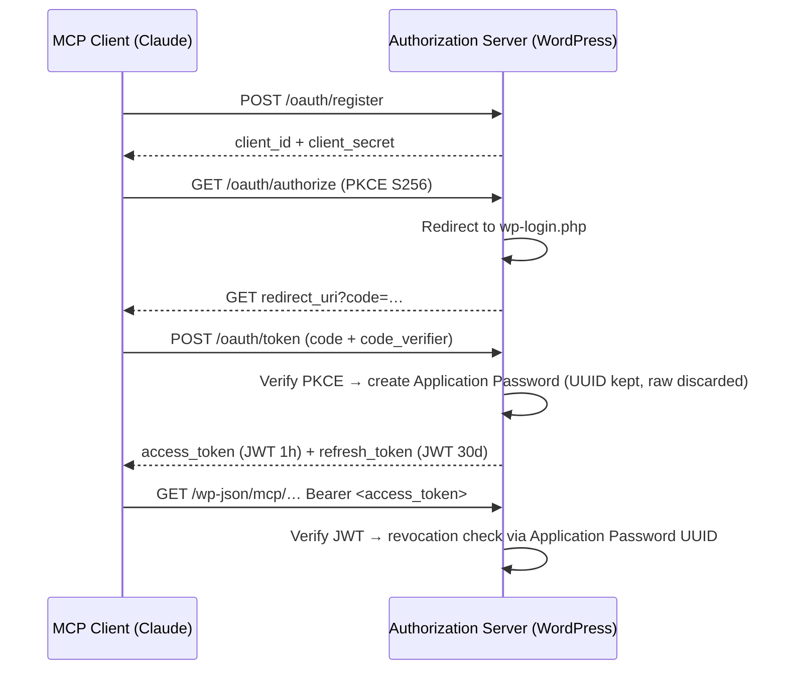

# MCP Authentication — OAuth 2.1 JWT Façade

Sybgo implements an OAuth 2.1 authorization server so that MCP clients (e.g. Claude) can authenticate against the site's MCP adapter. The design is **Option B: JWT Façade over Application Passwords** — the client sees only short-lived JWTs; WordPress Application Passwords never leave the server.

All source lives under `wp-plugin/src/MCP/Auth/`. The module is self-contained and documented for extraction into a standalone plugin (see `src/MCP/Auth/README.md`).

## Architecture

## Endpoints

All endpoints are registered as WordPress rewrite rules (no `/wp-json/` prefix).

| Path | Method | Handler class | Description |
|------|--------|--------------|-------------|
| `/.well-known/oauth-protected-resource` | GET | `Discovery_Endpoints` | RFC 9728 resource metadata |
| `/.well-known/oauth-authorization-server` | GET | `Discovery_Endpoints` | RFC 8414 server metadata |
| `/oauth/register` | POST | `Client_Registration` | RFC 7591 dynamic registration |
| `/oauth/authorize` | GET | `Authorize_Endpoint` | PKCE S256 authorization request |
| `/oauth/authorize-callback` | GET | `Authorize_Callback` | Post-login code issuance |
| `/oauth/token` | POST | `Token_Endpoint` | `authorization_code` and `refresh_token` grants |

Rewrite rules are registered on `init` and flushed during plugin activation via `Mcp_Auth::on_activation()`.

## JWT Token Claims

Access and refresh token structures are defined in `Token_Endpoint::issue_token_pair()`. Access tokens expire after one hour (`exp = iat + HOUR_IN_SECONDS`); refresh tokens expire after 30 days. Both embed `app_pass_id` (the UUID of the backing Application Password) for revocation checks.

The signing algorithm is HS256 with a 256-bit random secret stored in the `mcp_jwt_secret` wp_option (`Secret_Manager`).

## Middleware

`Request_Validator::validate_request(WP_REST_Request $request)` is the entry point for protecting MCP REST routes. It extracts the `Authorization: Bearer` header, verifies the JWT signature, checks the audience against `get_rest_url(null, 'mcp/mcp-adapter-default-server')`, and performs an Application Password revocation check. It returns a `WP_User` on success or a `WP_Error` (401) with a `WWW-Authenticate` challenge header on failure.

A convenience alias `mcp_validate_request(WP_REST_Request)` is defined in the same file for use in `permission_callback` closures.

## Revocation

Two levels of revocation are supported:

- **Individual session** — deleting the Application Password named `MCP Session – …` immediately invalidates all tokens that embed its UUID. Available via the admin page or `WP_Application_Passwords::delete_application_password()`.
- **Site-wide** — calling `Secret_Manager::regenerate()` rotates the HMAC signing secret; all outstanding JWTs become invalid regardless of their expiry.

## Admin UI

A "MCP Sessions" page is added under **Settings → MCP Sessions** (`Admin_Page`). It lists all Application Passwords whose name starts with `MCP Session` across all users, shows creation and last-used timestamps, and provides per-session revocation and a bulk "Revoke All MCP Sessions" button (which calls `Secret_Manager::regenerate()`).

## Bootstrap

`Mcp_Auth::boot()` (called once from `Sybgo::__construct()`) wires all hooks. `Mcp_Auth::on_activation()` (called from `Sybgo::activate()`) initialises the secret and registers rewrite rules before `flush_rewrite_rules()` runs.
